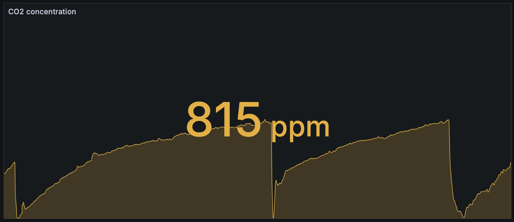

## carbonio

`carbonio` is a simple CO₂ concentraion metric exporter, which reads data from MH-Z19C sensor and exports the value as a Prometheus metric.

It is tolerant to the hot-plugging/restarting of the device or corrupted data on the UART line. Note that concentrations values {409, 499, 515} appear to be reserved and do not represent real data. In case the actual concentraion hits this value, it will be still ignored.